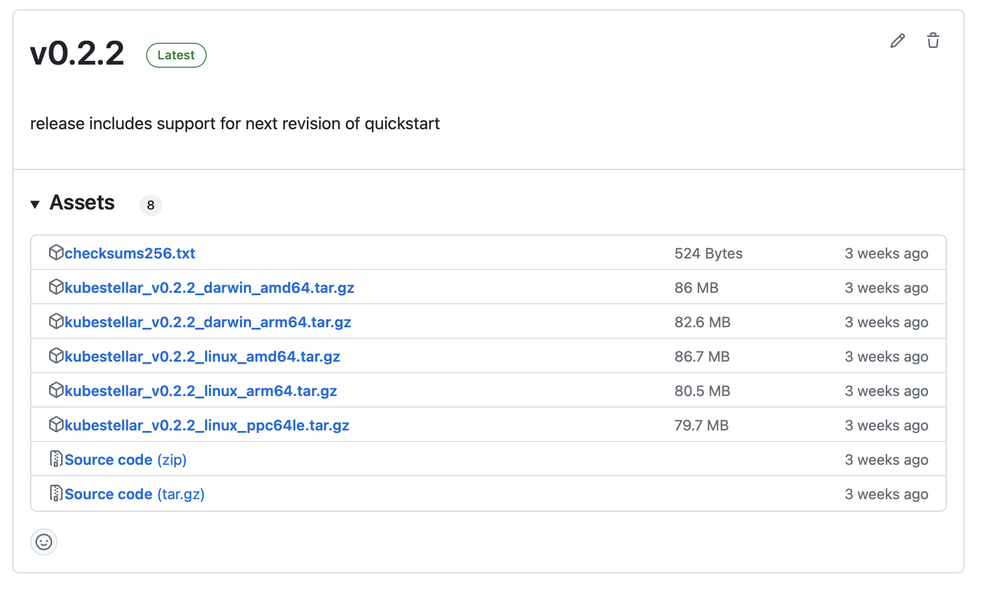

### Publishing a new KubeStellar release

#### Prerequisite - make sure you have a GPG signing key

1. [https://docs.github.com/en/authentication/managing-commit-signature-verification/generating-a-new-gpg-key](https://docs.github.com/en/authentication/managing-commit-signature-verification/generating-a-new-gpg-key)
2. [https://docs.github.com/en/authentication/managing-commit-signature-verification/adding-a-gpg-key-to-your-github-account](https://docs.github.com/en/authentication/managing-commit-signature-verification/adding-a-gpg-key-to-your-github-account)
3. [https://docs.github.com/en/authentication/managing-commit-signature-verification/telling-git-about-your-signing-key](https://docs.github.com/en/authentication/managing-commit-signature-verification/telling-git-about-your-signing-key)

### Create the tags

#### Note:
You currently need write access to the [{{ config.repo_url }}]({{ config.repo_url }}) repository to perform these tasks.

<!-- You also need an available team member with approval permissions from [https://github.com/openshift/release/blob/master/ci-operator/config/{{ config.repo_short_name }}/OWNERS](https://github.com/openshift/release/blob/master/ci-operator/config/{{ config.repo_short_name }}/OWNERS). -->

### Create a release-major.minor branch
To create a release branch, identify the current 'release' branches' name (e.g. release-0.2).  Increment the <major> or <minor> segment as part of the 'release' branches' name.  For instance, the 'release' branch is 'release-0.2', you might name the new release branch 'release-0.3'.

```shell
git clone git@github.com:{{ config.repo_short_name }}.git
cd {{ config.repo_default_file_path }}
git checkout main
git checkout -b release-<major>.<minor> # replace <major>.<minor> with your incremented <major>.<minor> pair
```

### Update the mkdocs.yml file
The mkdocs.yml file points to the branch and tag associated with the branch you have checked out.  Update the ks_branch and ks_tag key/value pairs at the top of the file

```shell
vi docs/mkdocs.yml
```

<b>before:</b>
```shell title="mkdocs.yml" hl_lines="2 3"
...
ks_branch: 'release-0.2'
ks_tag: 'v0.2.2'
...
```

<b>after:</b>
```shell title="mkdocs.yml" hl_lines="2 3" 
...
ks_branch: 'release-0.3'
ks_tag: 'v0.4.0'
...
```

### Remove the current 'stable' alias using 'mike' (DANGER!)
Be careful, this will cause links to the 'stable' docs, which is the default for our community, to become unavailable.  For now, point 'stable' at 'main'
```shell
cd docs
mike delete stable # remove the 'stable' alias from the current 'release-<major>.<minor>' branches' doc set
mike deploy --push --rebase --update-aliases main stable # this generates the 'main' branches' docs set and points 'stable' at it temporarily
cd ..
```


### Push the new release branch
```shell
git add .
git commit -m "new release version <major>.<minor>"
git push -u origin release-<major>.<minor> # replace <major>.<minor> with your incremented <major>.<minor> pair
```

### Update the 'stable' alias using 'mike'
```shell
cd docs
mike delete stable # remove the 'stable' alias from the 'main' branches' doc set
git pull
mike deploy --push --rebase --update-aliases releae-0.3 stable  # this generates the new 'release-<major>.<minor>' branches' doc set and points 'stable' at it
cd ..
```

### Test your doc site
Open a Chrome Incognito browser to [https://kubestellar.io](https://kubestellar.io) and look for the version drop down to be updated to the new release you just pushed with 'git' and deployed with 'mike'

### Create a build
```shell
./hack/make-release-full.sh v0.3.0
```

### Create a tagged release
View the existing tags you have for the repo

```shell
git fetch --tags
git tag
```

create a tag that follows <major>.<minor>.<patch>.  For this example we will increment tag 'v0.2.2' to 'v0.3.0'

```shell
TAG=v0.3.0
REF=release-0.3
git tag --sign --message "$TAG" "$TAG" "$REF"
git push ??? "$TAG"  #TODO - not sure if this is right
```

### Create a release in GH UI
- Navigate to the KubeStellar GitHub Source Repository Releases section at {{ config.repo_url }}/releases
- Click 'Draft a new release' and create a new tag ('v0.3.0' in our example)
    - Select the new release branch you just created (release-0.3)
    - Add a release title (v.0.3.0)
    - Add some release notes
    - Attach the binaries that were created in the 'make build-all' process above
        - You add the KubeStellar-specific '*.tar.gz' and the 'checksum256.txt' files
        - GitHub will automatically add the 'Source Code (zip)' and 'Source Code (tar.gz)'

    

### Check that GH Workflows for docs are working
Check to make sure the GitHub workflows for doc generation, doc push, and broken links is working and passing
[{{ config.repo_url }}/actions/workflows/docs-gen-and-push.yml]({{ config.repo_url }}/actions/workflows/docs-gen-and-push.yml)
[{{ config.repo_url }}/actions/workflows/broken-links-crawler.yml]({{ config.repo_url }}/actions/workflows/broken-links-crawler.yml)


<!-- ### Note sure if any of this PROW Stuff is necessary - we will see the next time we do a release..
- Configure prow for the new release branch

    - Make sure you have openshift/release cloned
    - Create a new branch
    - Copy ci-operator/config/kcp-dev/edge-md/kcp-dev-kcp-main.yaml to ci-operator/config/kubestellar/kubestellar/kcp-dev-kcp-release-<version>.yaml
    - Edit the new file
    - Change main to the name of the release branch, such as release-0.8

```
zz_generated_metadata:
  branch: main
```
Change latest to the name of the release branch

```
promotion:
  namespace: kubestellar
  tag: latest
  tag_by_commit: true
```
    - Edit core-services/prow/02_config/kcp-dev/kcp/_prowconfig.yaml
    - Copy the main branch configuration to a new release-x.y entry
    - Run make update
    - Add the new/updated files and commit your changes
    - Push your branch to your fork
    - Open a pull request
    - Wait for it to be reviewed and merged
    - Update testgrid

- Make sure you have a clone of kubernetes/test-infra
- Edit config/testgrids/kcp/kcp.yaml
- In the test_groups section:
- Copy all the entries under # main to the bottom of the map
- Rename -main- to -release-<version>-
- In the dashboard_groups section:
    - Add a new entry under dashboard_names for kcp-release-<version>
    - In the dashboards section:
        - Copy the kcp-main entry, including dashboard_tab and all its entries, to a new entry called kcp-release-<version>
        - Rename main to release-<version> in the new entry
        - Commit your changes
        - Push your branch to your fork
        - Open a pull request
        - Wait for it to be reviewed and merged
        - Review/edit/publish the release in GitHub

The goreleaser workflow automatically creates a draft GitHub release for each tag.

Navigate to the draft release for the tag you just pushed. You'll be able to find it under the releases page.
If the release notes have been pre-populated, delete them.
For the "previous tag," select the most recent, appropriate tag as the starting point
If this is a new minor release (e.g. v0.8.0), select the initial version of the previous minor release (e.g. v0.7.0)
If this is a patch release (e.g. v0.8.7), select the previous patch release (e.g. v0.8.6)
Click "Generate release notes"
Publish the release
Notify -->


### Create an email addressed to [kubestellar-dev@googlegroups.com](https://kubestellar.io/joinus) and [kubestellar-users@googlegroups.com](https://groups.google.com/g/kubestellar-users)

```
Subject: [release] <major><minor>
```
    - In the body, include noteworthy changes
    - Provide a link to the release in GitHub for the full release notes
    - Post a message in the [#kubestellar](https://kubestellar.io/slack) Slack channel
