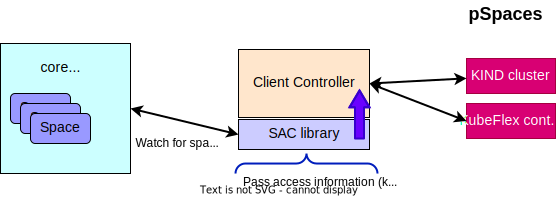
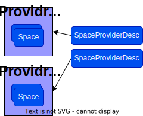

# Space Framework

## Terminology 
**Physical Space**, **pSpace** An entity that behaves like a Kubernetes kube-apiserver (including the persistent storage behind it) and the subset of controllers in the kube-controller-manager that are concerned with API machinery generalities (without the management of containerized workloads). A kcp logical cluster is an example. A regular Kubernetes cluster is another example.

**Space Object**, **Space** - A kind of Kubernetes API object that _represents_ a pSpace.  Its "kind" is `Space`, we sometimes include the "object" part when writing specifically about the API objects to clearly distinguish them from what they represent.

**Space Provider** - A Thing that manages the life cycle of multiple pSpaces. This includes at minimal create/delete/List operations on pSpaces. KIND is an example for Space Provider (that manages KIND clusters), KCP is another example - KCP manages KCP's workspaces. 

## High level architecture  & Main components


The Space Framework (SF) is a generic management framework for space providers and pSpaces. The framework defines an abstraction layer for space providers and pSpace management that allows clients (both script/kubectl based and client-go based clients) to use spaces while maintaining the clients decoupled from the specific pSpace and space provider that is being used. 

The space framework uses two CRDs:
- **SpaceProviderDesc:** This CRD represents a space provider it holds the information needed in order to interact with a specific Space  provider. 
- **Space:** This CRD represents a space as defined above. It includes reference to secrets that allow clients to connect to the pSpace that it represents and also several attributes used by the SF that will be described later on. 

Spaces can be divided into two categories:
1. Provider based spaces: The Space Manager (SM) uses a space provider to get information (or perform operations) on the spaces. We can think of such pSpaces as "belonging" to the space provider. There are two types of spaces in this category which controls the way these spaces are added to the space framework: 
   * **Managed Space**: The pSpace is created through an explicit request to the management api server to create a new Space. For Managed spaces the space framework initiates a request to the Space provider to create the pSpace, the space framework will then continuously reconcile between the Space and the pSpace states. For managed spaces the desired state is controlled through the Space object. For example, in order to delete the pSpace the client need to delete the corresponding Space object and the SF will interact with the space provider in order to delete the pSpace.
   * **Unmanaged Space**: The SF supports discovery of existing pSpaces on a space provider and adding them as "Unmanaged Spaces" into the framework. This mode is similar to the import mode in terms of the "source of truth" - the desired state is defined by the pSpace. However, as oppose to import, here the pSpaces are automatically discovered through the space provider regular interface and the pSpace access information is retrieved from the  space provider similarly to how it is done in the managed space case. The SF supports pattern based filtering rules to limit the discovery of pSpaces. 
  2. Providerless spaces: This spaces don't belong to a space provider and are called "Imported spaces". Such Space is created by importing an existing pSpace. In this case the Space is not linked to any space provider and the client which imports that Space need to supply the access information that allows other clients to connect to the pSpace. For imported spaces the desired state is derived by the pSpace. This means that the SF is not responsible for the life cycle management of the pSpace but only update the corresponding Space object. For example, when deleting the space object of an existing imported pSpace the space framework will recreate the space object. 
### Space Manager 
The Space Manager (SM) is a Kubernetes controller that is responsible for maintaining the state of the Space objects. The SM reconciles the Space and SpaceProviderDesc objects, and monitors the state of the pSpaces through the space provider.   
The SM uses a library of space provider adaptors to communicate with the space providers. Currently the SF supports 3 space providers KCP, KIND, and KubeFlex, and includes 3 space provider adaptors that the SM uses.

### Space provider adaptors
The space manager uses a set of space provider adaptors that interact with the space provider. All space provider adaptors implement a simple "space client interface" that includes basic pSpace life cycle operations. In addition the interface also defines the events that are sent from the adaptors to the space manager.

### Space aware client (SAC)
The Space aware client (SAC) allows clients/controllers to easily get access to the underlying space by simply using the space name and optionally the SpaceProviderDesc name. There is no direct interaction between the SAC and the Space  provider, and therefore the SAC is transparent to the specific provider of the spaces. 

The only requirement is that the space can be accessed through regular Kube APIs when using the appropriate kubeconfig information. 

**Main features**  
- Constantly watch for changes in the available spaces. The SAC is using an informer on Space objects using the SF Space client-go APIs.
    - Holds a cache of the pSpace access info for each Space 
- Exposes utility functions to get the [rest.Config](https://pkg.go.dev/k8s.io/client-go@v0.28.3/rest#Config) data structure that gives access to a physical space with the identity of a user that is authorized to do everything. This convenient function only needs the space name, and optionally the provider name (if the provider name is omitted the default provider is being used. The namespace where the Space resides can be derived from the name of the provider. In the future we will add a SAC space aware ClientSets as well.

## Architecture details 
When a new SpaceProviderDesc is created the SM creates a new namespace that will be used to host all the Space objects representing pSpaces on that space provider.  
The name of the generated namespace will be `spaceprovider-<provider name>`



Note: In the future the spaces will be created in their own namespace and not in namespace per provider. 

The Space also holds a reference to the SpaceProviderDesc associated with this Space and some capabilities (e.g., the space type). The status of the space holds a secret reference to the secret holding the access information for that pSpace. As described before for managed spaces the SF retrieves that information from the space provider, and then creates the needed secrets and updates the Space object with the secret reference

**Discovery**  
As mentioned before, the Space manager also supports discovery of spaces created out of band (i.e., not through creating Space objects).

Each provider adaptor constantly watches for pSpace creation/deletion events and feeds the SM with those events. In case a pSpace that matches the discovery filtering is detected and there is no corresponding Space object the SM creates a Space object representing this new detected pSpace and sets its mode to “unmanaged” .
When the pSpace is deleted the SM deletes the corresponding Space object.

**Creation & Deletion flow of managed Spaces**  
The SM sets the status of the Space according to the actual status of the pSpace. When a space is created a creation command is sent to the space provider and the state of the Space is set to `Initializing`. Only when the pSpace is becoming available (each space provider validate this in its own way) the SM sets the Space state to `Ready`.   
The SM uses finalizers for the space deletion flow - the Space object is not removed until the corresponding pSpace is deleted by the space provider.

## Examples

**SpaceProviderDesc**
The following is a SpaceProviderDesc for for a KubeFlex provider type. The SpaceProviderDesc will become "Ready" only after the secret referenced by `secretRef` is successfully retrieved.
```
apiVersion: space.kubestellar.io/v1alpha1
kind: SpaceProviderDesc
metadata:
  name: pkflex
spec:
  ProviderType: "kubeflex"
  SpacePrefixForDiscovery: "ks-"
  secretRef:
    namespace: default
    name: pkflex
```

**Space**
The following is a Space YAML that is used to create a managed space on the previously defined KubeFlex provider. 
The use need to specify the correct namespace for the space
```
apiVersion: space.kubestellar.io/v1alpha1
kind: Space
metadata:
  name: space5
  namespace: "spaceprovider-pkflex"
spec:
  SpaceProviderDescName: "pkflex"
  Type: "managed"
```